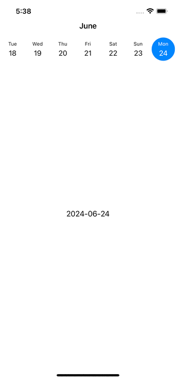

# CalendarView

Very simple horizontally scrolling calendar view implementation.

Characteristics:
- today is initially selected
- when other day than today is selected, today is always highlighted
- previous week i.e. 7 days are always visible 
- intially only today is loaded, then 10 previous days are loaded
- if last day from previously loaded is being rendered on the screen, previous 10 day are added to the list
- month text is changing dynamically, when 4 out of 7 days are visible on the screen
- height is computed automatically based on screen width and accesible by delegate method
- implement `CalendarObserving` and set `CalendarViewModel.delegate` to use its methods

This package is inspired and influenced by [FRHorizontalCalendar](https://github.com/emrepun/FRHorizontalCalendar/).
